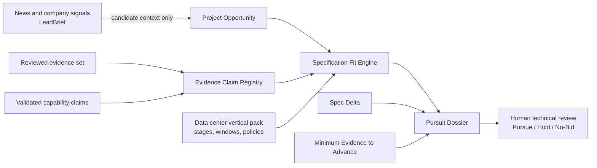

# Pursuit Twin KR

> 한국 데이터센터 인프라 프로젝트의 요구사양과 검증된 제품 능력
> 근거를 대조해, 사람이 입찰 전 기술 적합성·사양 영향 구간·근거
> 공백을 검토하도록 돕는 evidence-first 의사결정 시스템입니다.

An evidence-first, human-gated project-to-spec decision system for industrial
pursuit review.

## Product Thesis

일반적인 회사 리드 점수 대신 다음 단위를 제품의 중심에 둡니다.

```text
Project Opportunity
× Product Family
× Specification Window
× Evidence Set
```

뉴스와 `LeadBrief`는 Project Pursuit 후보를 찾는 상류 신호입니다.
기술 적합성은 검증된 프로젝트 요구사항과 제품 capability claim만으로
별도 평가합니다.

## Current Scope

| Boundary | Current state |
| --- | --- |
| Product surface | `Pursuit Twin KR` / Project Pursuit first |
| Vertical | Data center infrastructure |
| Initial technical focus | Electrical infrastructure, with MV switchgear and transformer as the intended narrow product-family focus |
| Evidence | Repository-reviewed synthetic fixtures only |
| Public Golden Dataset | 39 real public-source URL candidates across 17 projects; approved Batch 01 and Batch 02 repository assertions now cover all 17 projects, 30 capabilities, 10 pairs, 1 revision, and 5 lifecycle stages; `HUMAN_CONFIRMED`, `goldenReady:true` |
| Pursuit Value Pilot | Five-reviewer/one-team private local intake is prepared around five counterbalanced synthetic project cases; completed human evidence remains `0/5` and `INCOMPLETE` |
| Fit decision | Deterministic and fail-closed |
| Final Pursue / Hold / No-Bid | Human decision; system value remains `NOT_MADE` |
| Production readiness | `false` |

The executable synthetic foundation currently has stronger capability coverage
for MV switchgear than transformer. Product-family labels are not claims of
real market or customer fit.

## Implemented Foundation

- Evidence Claim Registry with typed values, provenance, status, applicability,
  expiry, conflicts, and customer-use gates.
- Project Opportunity v0 contract with evidence-bound technical requirements.
- Deterministic Specification Fit Engine with `FIT`, `CONDITIONAL_FIT`,
  `INSUFFICIENT_EVIDENCE`, `NOT_FIT`, and `NOT_EVALUATED`.
- Specification Window evaluation separated from technical fit.
- Pursuit Dossier with evidence traces, conflicts, missing requirements,
  bounded technical questions, and explicit non-claims.
- Spec Delta with hash-linked Project Opportunity revisions, requirement and
  evidence changes, recomputed fit/window transitions, and fail-closed human
  decision review invalidation.
- Minimum Evidence to Advance with a deterministic smallest re-evaluation
  evidence set, explicit non-evidence gates, and no guarantee of `FIT`.
- Pursuit Value Pilot v0 with five hash-bound synthetic cases, fixed
  counterbalanced reviewer assignments, private offline human intake, and a
  redacted deterministic aggregate that stays `INCOMPLETE` until all five
  human sessions and one team-week record are complete.
- Human-gated review boundaries and deterministic local tests.

## Architecture



The detailed authority and trust-boundary view is in
[`docs/architecture/pursuit-twin-v0.md`](docs/architecture/pursuit-twin-v0.md).

## Run the Local Foundation

```bash
npm ci
npm run audit:claims
npm run eval:spec-fit
npm run eval:pursuit-twin
npm run eval:pursuit-value-pilot
npm run check:pursuit-value-pilot
npm run test:claim-spec-fit
npm run check:golden-dataset
npm run prepare:golden-review-batch
npm run prepare:golden-review-proposal
npm run prepare:golden-review-batch-02
npm run prepare:golden-review-proposal-02
```

Full repository validation:

```bash
npm test
npm run test:e2e:local
```

These commands use local/synthetic evidence. They do not call production
endpoints, prove a production deployment, or validate a real customer
opportunity.

Prepare the separate private human pilot only when qualified reviewers are
ready:

```bash
npm run prepare:pursuit-value-pilot
npm run validate:pursuit-value-pilot
```

Preparation creates ignored private files only. It does not simulate human
answers, transmit a response, or turn a blank template into pilot evidence.

## Product Surface

- `/`: Project Pursuit positioning and current foundation first.
- `/leads`: upstream project-signal review queue based on LeadBrief.
- Company/industry self-service: secondary signal-discovery tool.
- PPT, proposal, CPA, and roleplay: secondary helper tools, not technical
  decision sources of truth.

The repository/package identity remains `b2b-lead-agent` for compatibility even
though the product-facing name is `Pursuit Twin KR`.

## Prioritized Roadmap

1. **Product identity transition** — make Project Pursuit the primary product
   surface and demote generic lead tooling. This repository slice implements
   that information-architecture change.
2. **Golden Dataset** — this repository separates 17 real public-project
   candidates, 39 public source candidates, 30 capability claim candidates,
   10 requirement/capability pair candidates, and one real IEC revision edge
   from human adjudications. The hash-pinned Batch 01 proposal was explicitly
   approved as written by the named reviewer assertion and materialized as
   10 project, 30 capability, 10 pair, and one revision adjudication. The
   receipt records a repository assertion, not authenticated identity. The
   additive v1 candidate layer preserves that approval and adds official Wanju
   `FEASIBILITY` and Ulsan `DESIGN` evidence. Batch 02 was then explicitly
   approved as written and materialized the remaining seven project decisions
   without reopening Batch 01. The offline audit now reports
   `HUMAN_CONFIRMED`, five human-confirmed lifecycle stages, and
   `goldenReady:true`; this is still `NOT_PRODUCTION_EVIDENCE` and does not
   change production readiness.
3. **Pursuit Twin v0** — this repository implements Spec Delta and Minimum
   Evidence to Advance as versioned, hash-bound, deterministic local/synthetic
   contracts. A changed revision recomputes fit/window state and requires a
   prior human decision to be reviewed; it never silently changes that
   decision. Minimum Evidence identifies what can enable re-evaluation, never
   what guarantees `FIT`.
4. **Pursuit Value Pilot** — this repository implements the separate
   local/test-safe method, five counterbalanced synthetic cases, standalone
   offline reviewer pages, fixed private intake, and deterministic redacted
   aggregation for review-time reduction, traceability, accepted technical
   state, detected gaps, unsupported-claim safety, repeat-use intent, and one
   anonymous weekly team. Human evidence remains `0/5` and `INCOMPLETE`;
   blank/generated records are never counted.

Counterfactual Fit, live official-data ingestion, real authenticated reviewer
identity, production deployment, CRM mutation, outreach, and automated final
decisions remain separately scoped.
