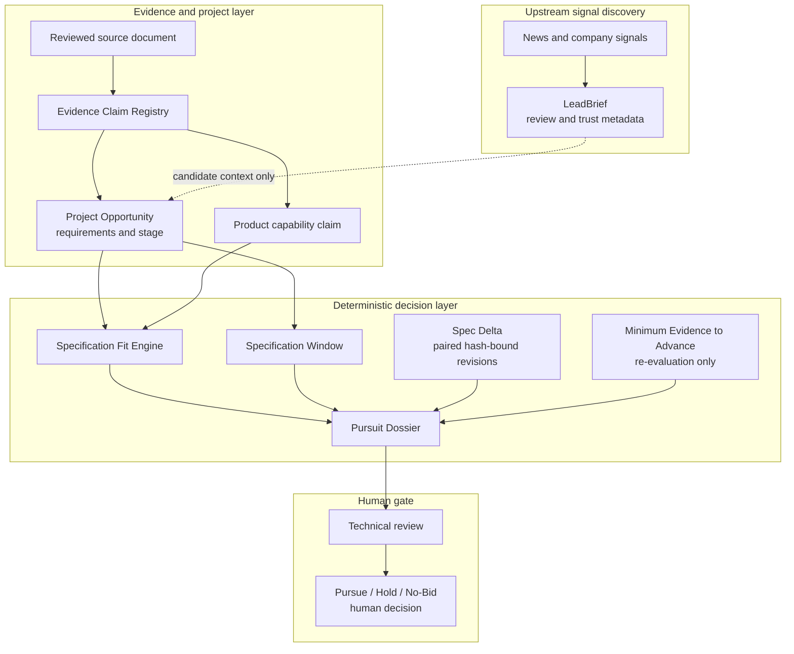

# Pursuit Twin KR — Product and Authority Architecture

## Status

- Product-facing name: `Pursuit Twin KR`.
- Repository/package identity: `b2b-lead-agent`.
- Executable fit evidence boundary: `LOCAL_TEST_SYNTHETIC_ONLY`.
- Public Golden Dataset boundary: `NOT_PRODUCTION_EVIDENCE`; dataset state
  `HUMAN_CONFIRMED` and `goldenReady:true`, independently of production
  readiness.
- Technical decision scope: `TECHNICAL_FIT_AND_SPEC_WINDOW_ONLY`.
- Runtime final human pursuit decision: `NOT_MADE`; Golden Batch 01 and 02
  record non-production repository adjudication assertions only.
- Production readiness: `false`.

The Golden Dataset now covers 17 projects, 30 capabilities, 10 pairs, one
revision, and five lifecycle stages through two explicit supplied human-review
repository assertions. Those assertions do not authenticate reviewer identity
and are not promoted into the executable Claim Registry. This document does
not approve official-data ingestion, production access, or deployment.

## Product Unit

The differentiated review unit is:

```text
Project Opportunity
× Product Family
× Specification Window
× Evidence Set
```

A LeadBrief is upstream candidate context. It is not a Project Opportunity,
verified technical requirement, capability claim, fit result, or final pursuit
decision.

## Authority Flow



## Decision Authority

| Surface | May provide | Must not provide |
| --- | --- | --- |
| Signal discovery / LeadBrief | Candidate context, source links, trust metadata, data gaps | Verified requirement, verified product capability, final fit |
| Claim Registry | Validated claims, provenance, evidence status, conflicts, applicability | Model-authored verification or favorable-claim selection |
| Specification Fit Engine | Deterministic fit state, reason codes, claim traces | Commercial approval or final pursuit decision |
| Specification Window | Stage-policy result and reason codes | A claim that an unverified project stage is known |
| Spec Delta | Hash-linked source-revision, requirement, evidence, fit, and window transitions; whether a prior human decision requires review | Silent carry-forward or automatic replacement of a human decision |
| Minimum Evidence to Advance | The smallest deterministic evidence set that can enable re-evaluation, plus time/config/scope gates | A promise that collecting evidence will produce `FIT` |
| Pursuit Dossier | Evidence-backed facts, assumptions, conflicts, gaps, technical questions | Outreach approval, automatic bid decision, production-readiness claim |
| Human review | Pursue, Hold, or No-Bid decision within an approved process | Retroactive mutation of source evidence |

## Current Product Surface Mapping

| Product layer | Current surface |
| --- | --- |
| Project Pursuit identity and decision model | Worker home page primary tab |
| Upstream signal discovery | Worker home page secondary self-service tab |
| Upstream signal review | `/leads`, labeled as the project-signal review queue |
| Proposal, PPT, CPA, roleplay | Collapsed secondary tools |
| Claim/spec-fit executable foundation | `knowledge/claim-registry/`, `verticals/datacenter/`, `eval/spec-fit-evaluator.mjs` |
| Deterministic evidence packet | `buildPursuitDossier()` in `verticals/datacenter/index.mjs` |
| Revision delta and minimum evidence packet | `verticals/datacenter/pursuit-twin-v0.mjs`; local/test synthetic only |
| Read-only product example | Worker home page Project Pursuit tab; no API, D1, or persistence authority |
| Product-value pilot | Five counterbalanced synthetic packet cases plus private offline reviewer intake and redacted aggregate; human evidence remains `INCOMPLETE` until 5/5 sessions and one team-week record are completed |
| Public Golden Dataset human-confirmed audit | `knowledge/golden-dataset/`; Batch 01/02 remain separate from executable verified claims and non-production |

There is no `/pursuits` runtime route in this slice. A route must not be exposed
until a truthful Project Pursuit read/input contract exists.

## Next Contracts

1. Execute the separately implemented Pursuit Value Pilot with five qualified
   de-identified humans and one team. Machine-generated cases, templates,
   tests, and hashes remain `INCOMPLETE`, not human value evidence.
2. Define an authenticated human decision record before any live carry-forward
   workflow; the current prior-decision input is a bounded repository assertion.
3. Define a truthful official Project Opportunity ingestion and read contract
   before exposing a `/pursuits` runtime route or persistence.

Counterfactual Fit requires a separate assumption namespace and must never
enter customer-usable claims or final decisions as verified evidence.
